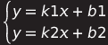

# PointLocationCalculator
## Описание
PointLocationCalculator - десктоп утилита, которая позволяет рассчитать, находится ли точка за пределами многоугольника, или в нем.
Метод решения задачи - [_**трассировка лучей**_](README.md#описание-метода).

## Функционал
* Расчет местоположения точки
* Импорт вершин многоугольника
* Изменение точности расчётов

## Инструкция
### Ввод вершин многоугольника
Вы можете ввести вершины многоугольника вручную или импортировать их.
> [!TIP]
> * Если вы хотите убрать последнюю вершину многоугольника, намжите кнопку "_**Убрать**_".
> * Если вы хотите удалить многоугольник с полотна, нажмите правой кнопкой мыши по полотну и выберите "_**Очистить**_".

#### Вручную
Под заголовком "Введите координаты точки многоугольника" расположены поля "_**X**_" и "_**Y**_"
1. В поле "_**X:**_" введите значение X точки вершины.
1. В поле "_**Y:**_" введите значение Y точки вершины.
1. Нажмите кнопку "_**Добавить**_".

На полотно добавится вершина многоугольника, чтобы построить грань, добавьте еще одну точку.
Чтобы построить многоугольник, точек должно быть больше 2-х.

#### Импорт
В левом верхнем углу расположено меню.

1. Нажмите "_**Импорт**_".
1. Далее нажмите "_**Выбрать файл**_".
1. Откроется диалоговое окно выбора файла.
1. Впишите название файла или выберите файл с форматом `.csv`.
1. Нажмите "_**Открыть**_".

Если с файлом все хорошо, программа выдаст сообщение "Импорт произошел успешно" и
отобразит многоугольник с заданными вершинами из файла.
### Ввод координат тестовой точки
Под заголовком "Введите координаты тестовой точки" расположены поля "X" и "Y"
1. В поле "_**X:**_" введите значение X тестовой точки.
1. В поле "_**Y:**_" введите значение Y тестовой точки.

Если координаты заданы правильно, на полотне отобразится красная точка, которая является тестовой точкой.

### Проверка местоположения точки
#### Основная часть
Если на полотне присутствует многоугольник с 3-мя и более вершинами, а также, тестовая точка, то можно запускать проверку.
> Если многоугольник состоит из 2-х и менее вершин, программа фактически не будет выполнять проверку, а скажет, что точка находится снаружи.

1. Для этого, под заголовком "Введите координаты тестовой точки", нажмите кнопку "_**Проверить**_".
1. Программа проанализирует местоположение точки и вернет результат.

Если точка находится снаружи, программа выдаст сообщение "Точка снаружи", а если внутри - "Точка внутри".

#### Дополнительно
После завершения проверки, вы можете увидеть, как программа определяет местоположение с помощью "_**Отобразить трассировку**_".
У точки появятся лучи, с помощью которых программа понимает, где точка.

Точность расчетов отвечает за то, сколько лучей будет выпущено из точки. Изначально, точность равна 4 лучам, которые идут в 4 стороны от точки.
Необходимо это для того, чтобы быть уверенным, что в случае пересечения лучом вершины многоугольника программа не выдала неверный результат.
Когда один луч указывает находится ли точка внутри многоугольника, а остальные лучи показывают обратное, можно используется принцип большинства для принятия решения.

## Как выглядит метод трассировки лучей в программе?
### Описание метода
Метод трассировки лучей в программировании используется для определения пересечений луча с геометрическими объектами, такими как многоугольники или другие формы. 
* Если количество пересечений луча с границей фигуры кратно двум, то можно сделать вывод, что точка находится снаружи фигуры.
* Если количество пересечений луча с границей фигуры равно одному, то это говорит о том, что точка находится внутри фигуры.

### В программе
1. У нас имеется коллекция `PolygonPoints`, которая содержит вершины многоугольника.
1. Пара точек из коллекции `PolygonPoints` образует грань многоугольника `edge`
1. Нам необходимо пройтись по всем граням многоугольника и посчитать количество пересечений луча, идущего от точки  `testPoint`.
1. В системе уравнений программы, луч является верхним уравнением, а грань - нижним.
1. Чтобы найти точку пересечения двух прямых, необходимо составить систему уравнений вида:
    
<picture> </picture>

    > где ***X***, ***Y*** - точка пересечения, ***K1*** - угловой коэффициент луча, ***K2*** - угловой коэффициент грани, ***B1*** - ордината луча, ***B2*** - ордината грани.

5. Чтобы найти ***X*** и ***Y***, необходимо знать, чему равны ***K1*** и ***B1*** луча, и ***K2*** и ***B2*** грани. Т.к. мы задаем точки для вершины и указываем тестовую точку, с которой начинается луч, мы можем найти эти значения. Чтобы найти ***K1***, ***B1***, ***K2***, ***B2*** необходимо составить систему уравнений для двух точек. Преобразуем предыдущую систему уравнений:
    
<picture> </picture>

    > где ***K*** - угловой коэффициент прямой, ***B*** - ордината прямой, ***X1***, ***Y1*** - координаты начальной точки, ***X2***, ***Y2*** - координаты конечной точки.

   Т.к оба выражения равны ***B***, то запишем его как:
   `Y1 - KX1 = Y2 - KX2`

   Выразим ***K*** и получим: `K = (Y2 - Y1)/(X2 - X1)`

   Соответственно ***B*** равен: `B = Y1 - KX1 = Y2 - KX2`

   Таким образом найдем значения ***K1***, ***B1*** луча и ***K2***, ***B2*** грани.
   > Мы можем найти ***K*** только в том случае, если `X1` != `X2`, иначе ***K*** будет равен 0,
   > a ***B*** соответственно равным: `B = y1 = y2`
   
5. Подставляем полученные значения в систему уравнений:
       
<picture> </picture>

   Т.к оба выражения равны ***Y***, то запишем его как:
   
   `k1x + b1 = k2x + b2`

   Выразим ***X*** и получим: `x = (b2 - b1)/(k1 - k2)`

   Соответственно ***Y*** равен: `y = k1x + b1 = k2x + b2`

5. Точка пересечения грани и луча равна полученным значениям ***X*** и ***Y***, если точка входит в диапазон между точек грани и больше тестовой точки, то луч пересекает грань.
Пусть ***n*** - количество граней, которые пересек луч. Если ***n*** делится на 2 без остатка, то точка находится снаружи, иначе - внутри. 

## Архитектура приложения
**Паттерн MVVM** подразумевает, что программа состоит из 3 частей:
* View - пользовательскией интерфейс (описывает, как данные должны отображаться пользователю).
* View-Model - функционал программы (взаимодействие View и Model).
* Model - бизнес логика (содержит классы, отвечающие за доступ к данным и их обработку).

В проекте реализованы View и View-Model.
Если мы захотим добавить Model, то разделение компонентов позволит сделать это максимально эффективно.

Кроме того, в программе используется **паттерн Command**, который помогает отделить логику действия пользователя от его представления,
делая код более модульным и удобным для тестирования

## Технологии
Основной стек:
* C#
* WPF
* MVVM

Прочий стек:
* Microsoft.Xaml.Behaviors.Wpf
* CsvHelper

## Ссылки
Проект реализован по [заданию](https://disk.yandex.ru/d/cTMQ5OgOPhadAw) от работодателя.
